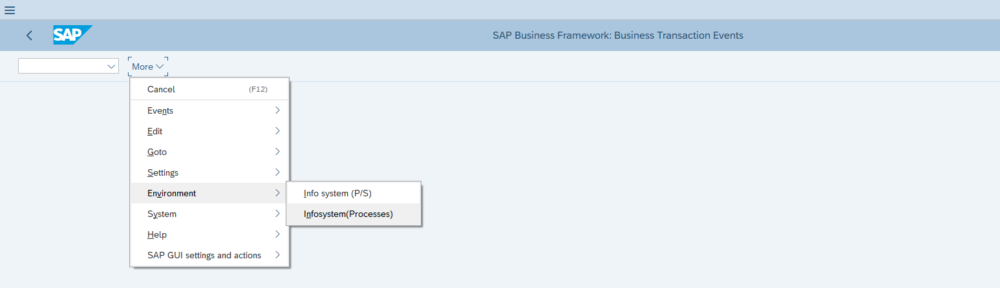
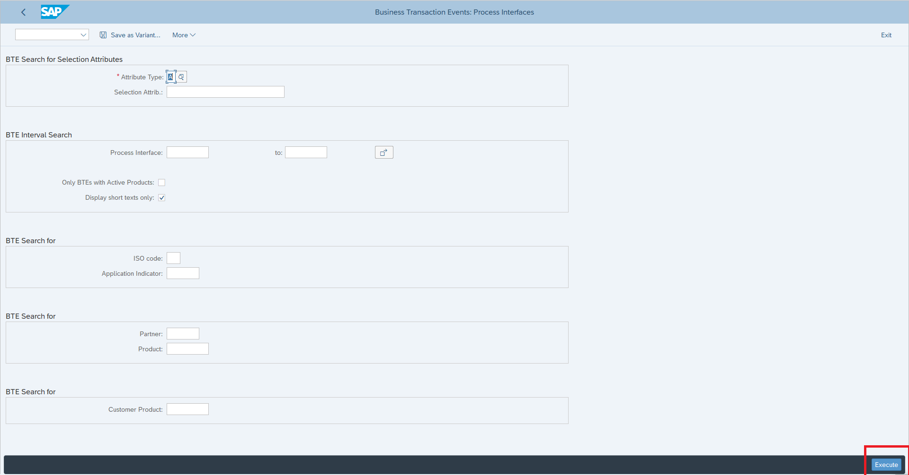
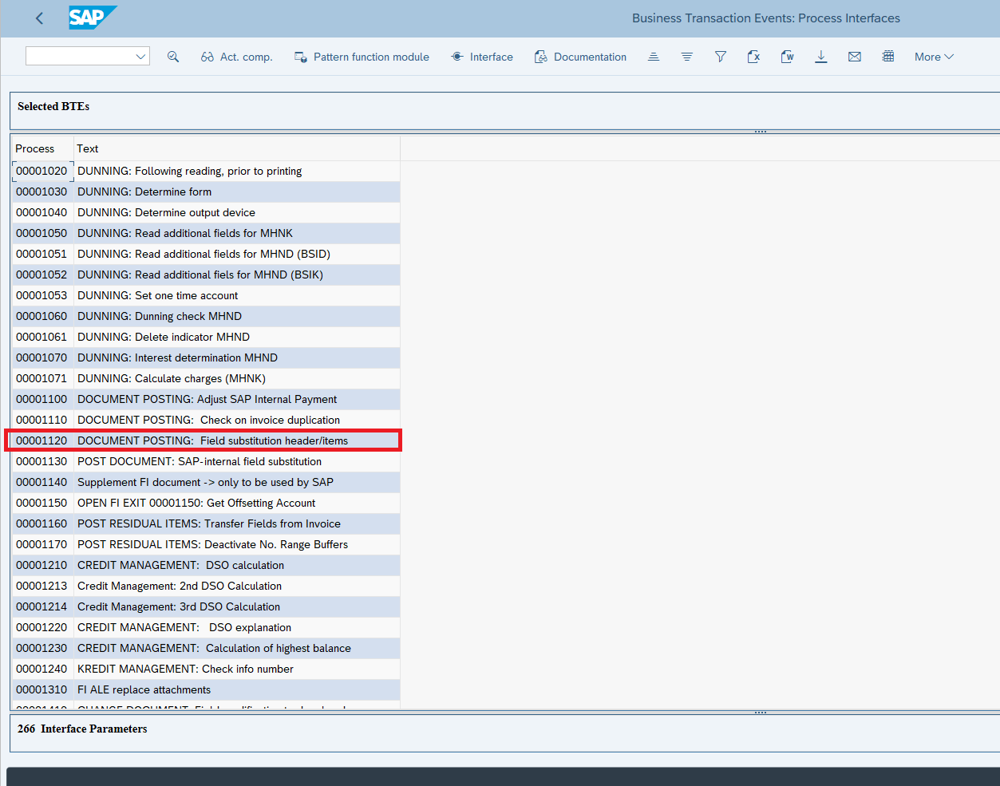
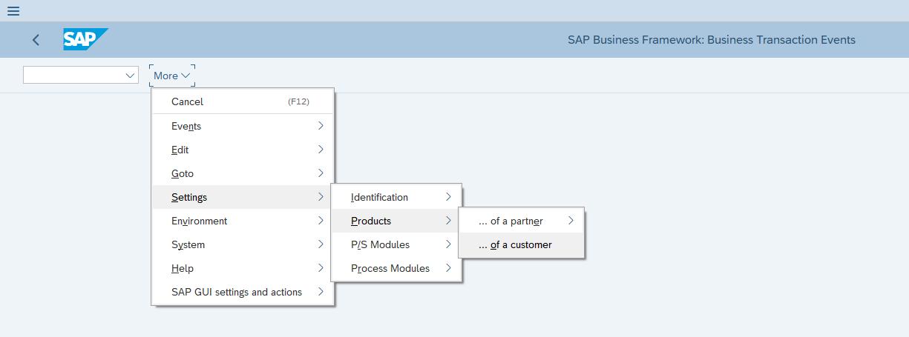
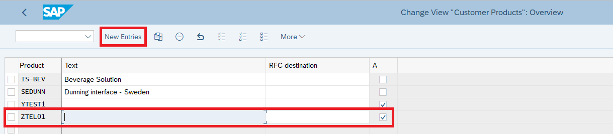
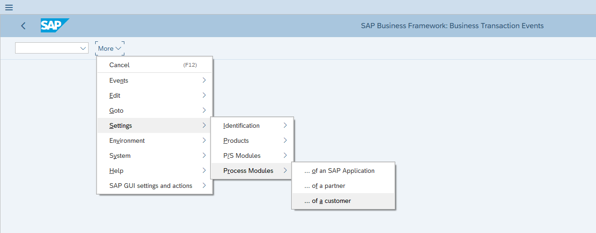
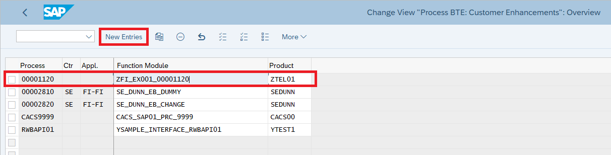
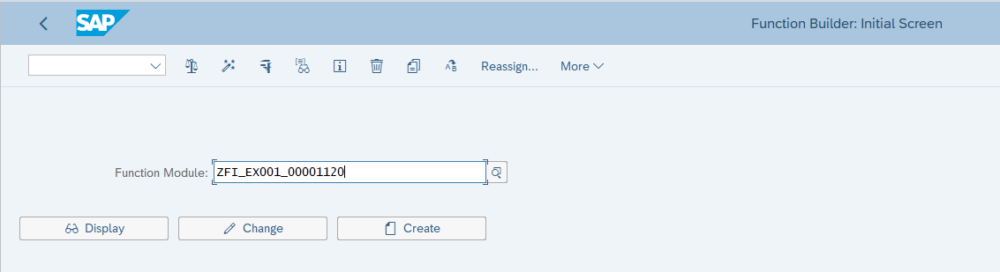

# FIBF example
*Maintenance transaction BTE(Business Transaction Events)*

## Target
Field substitution of line items when posting acccounting documents

## Procedure
1. Find the right process

2. Add a product

3. Add a function module

4. Edit your code in SE37 - Function Module Builder

