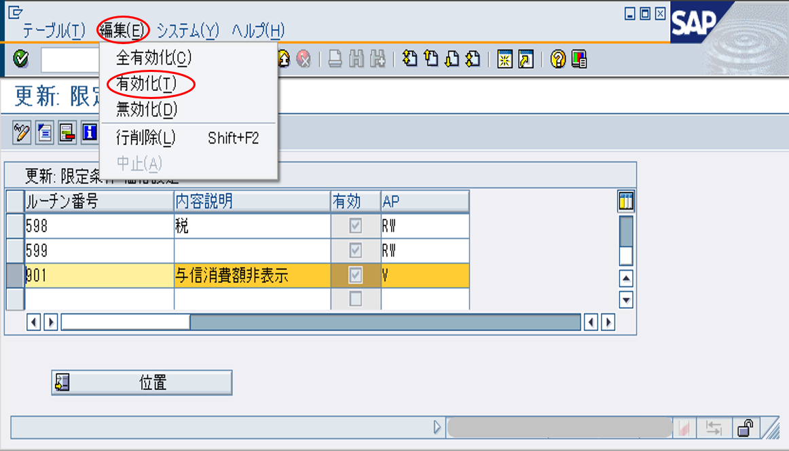
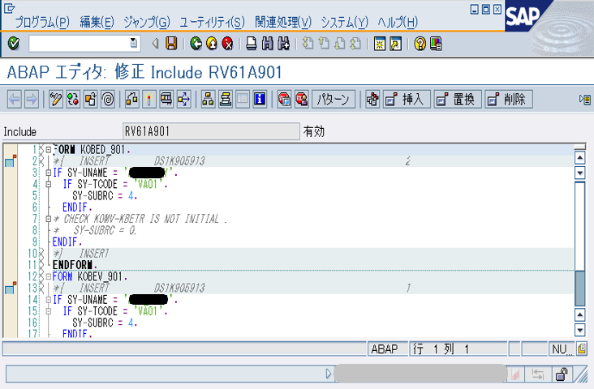

# VOFM example
*Configuration for Reqs, Formulae*

## Target_1
与信消費額の算出・設定

## Procedure_1
1. ルチン登録

  **以下により、ルチンを登録する。※「900」以降の番号を指定する**

2. ルチン有効化

3. 配置  
  **T-Code:SPRO**

  **条件タイプ「ZPCA」を指定して、DB「T683S」から取得する決定表が配置対象とする**

  **代替計算タイプにルチン番号をセットする**

4. ルチンのコード編集

## Target_2
与信消費額非表示

## Procedure_2
1. ルチン登録

  **以下により、ルチンを登録する。※「900」以降の番号を指定する**

2. ルチン有効化

3. 配置  
  **T-Code:SPRO**

  **条件タイプ「ZPCA」を指定して、DB「T683S」から取得する決定表が配置対象とする**

  **限定条件にルチン番号をセットする**

4. ルチンのコード編集

